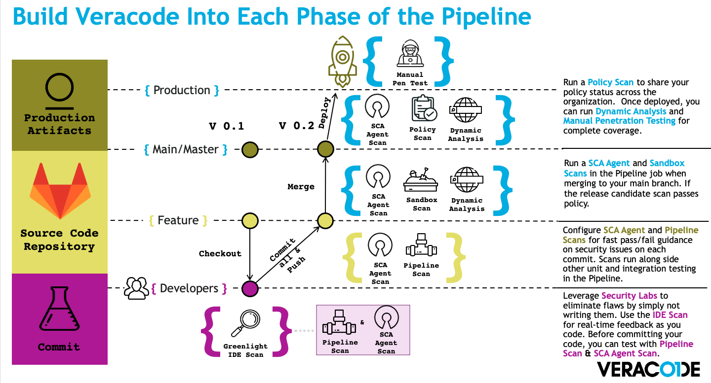
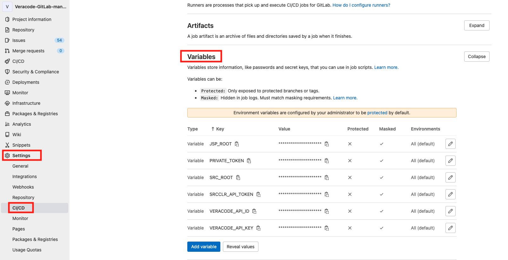
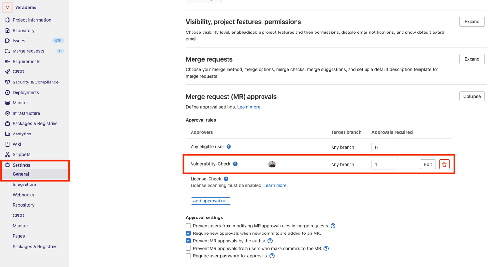
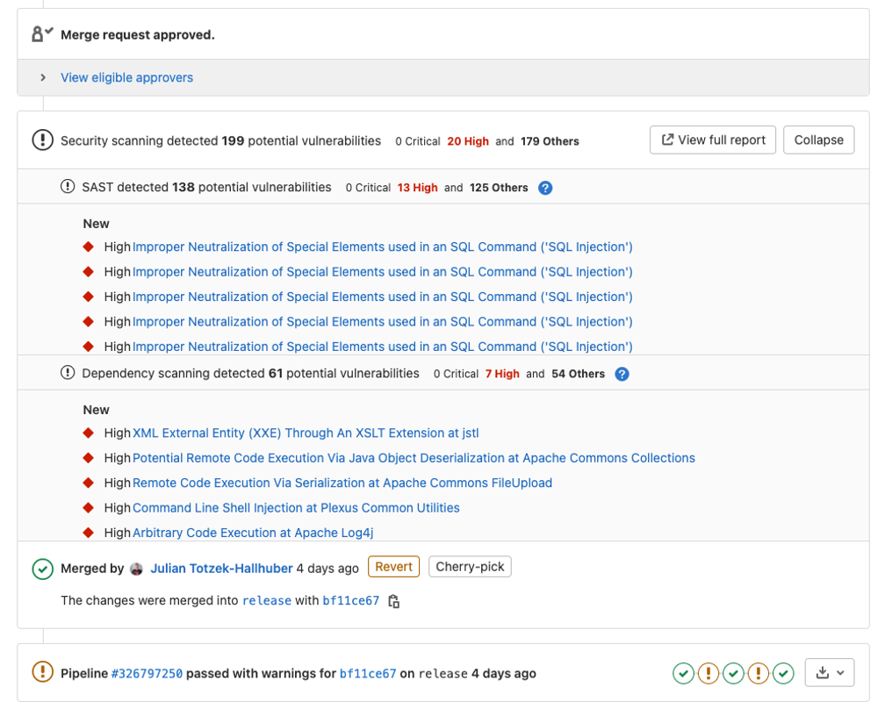

<br>  
  
# Veracode-manual-for-GitLab

## Overview
  
This documentation should help Veracode customers to understand how they ca integrate Veracode scanning technologies into GitLab. It is almost universal to many other CI/CD tools, but this documentation is mainly focused on GitLab and it's specifics.  
Using this documentation you will be able to automte static, SCA and dynamic scanning from within your GitLab pipeline. As well you will learn how to scale application security testing in a larger organization with a lot of repositories. 


## Veracode Scanning Techologies
### Static Analysis  
Veracode offers 3 types of static analysis  
1. Pipeline Scan 
2. Sandbox Scan  
3. Policy Scan  
  
All 3 are run on different needs and have different purposes, all are based on the same engine in the background and all 3 should find the exact same results if the same binary is uploaded.  

1. Pipeline Scan  
The Veracode Pipeline Scan was desgined as a fast feedabck tool for developers and may runs with every single commit. It can rate in very early stages what are the policy relevant findings a developer need to fix in order to achieve policy compliance later on. As well it gives you the possibility to see net-new findings of a single commit.  
It can scan the full application or smaller parts that have canged.  
  
2. Sandbox Scan  
Similar to the Pipeline Scan, the Sdandbox scan runs in early stages of your code. It's puprose is to scan the full application and rate the findings according to the profile's policy. This will allow you to see findings that need to be fixed in order to achieve policy compliance later one.  
  
3. Policy Scan  
The Policy Scan is the last gate to production. It should scan the full application and according to the policy compliance you can decide wether the application is allowed to be deployed or not.  

### Software Composition Analysis  
Software Composition Analysis at Veracode can be done in 2 different ways.  
  
1. With static analysis (Upload and Scan)  
2. Individual SCA scan of the application and docker containers (Agent Based Scan)  
  
On this documentation we will mainly talk about the Agent Based Scan, that could run on every stage of your code.  

### Dynamic Analysis  
Veracode#s Dynamic Analyssis gives you the possibility to scan standard or single page web applications and as well API's while they are running either at a stageing environment or at production.  
Both types of scan will be run and configured the exact same way.  
  
## Automation Process  
The picture below should highlight in a visual way whcih scan type runs at which stage of your code. It also is "only" Veracode's idea how it makes sense to impletment a good process to application security testing.  
Every organization is doing this a bit differently, depending on how their processes are set up. Veracode gives you the felxibilitxy to choose which scan type should run where on your different stages of your pipeline and your code.  
  
  


## Pre-built docker images  
Veracode released and maintain a set of public Docker Images which are available at DockerHub. There are 3 docker images available, that are all used on this example documentation.  

1. [api-wrapper-java docker image](https://hub.docker.com/r/veracode/api-wrapper-java)  
Will give you access to the Veracode Java wrapper.   
Using this image you can start static analysis scans, policy and sandbox scans.  
  
2. [pipeline-scan docker image](https://hub.docker.com/r/veracode/pipeline-scan)  
Will give you access to the Veracode Pipeline Scan.   
Using this image you can start pipeline scan scans.  
  
3. [api-signing docker image](https://hub.docker.com/r/veracode/api-signing)  
Will give you access to Veracode's hmac authentication.   
Using this image you can start dynamic analysis scans, get access to findings on the platform and more.  


## Integrating into GitLab  
This documentation incudes 4 GitLab projects to show an example how to use all Veracode scanning technologies, in an autoamted way on your GitLab pipeline. There are examples on static analysis, software composition analysis, dynamic analysis and results import as GitLab issues.  
The 4 projects are:  
  
1. [Veracode-manual-for-GitLab](https://gitlab.com/veracode-gitlab-manual/veracode-manual-for-gitlab)  
This documentation.  
2. [Pipeline-Templates](https://gitlab.com/veracode-gitlab-manual/pipeline-templates)  
yml templates to be used on your pipeline.  
3. [Veracode-helpers](https://gitlab.com/veracode-gitlab-manual/veracode-helpers)  
Helper scripts for very specific tasks.  
4. [Veracode-GitLab-manual-MyApp](https://gitlab.com/veracode-gitlab-manual/veracode-gitlab-manual-myapp)  
A demo java application, with a full yml pipeline and all possible scanning technologies set up. As well integrating reporting functionality.  
  
### General GitLab environment variables  
For all scanning and reporting work properly you need to set up a few GitLab environment variable that will be (automatically) picked up by the pipeline tasks. The configuration will be done on your repository at Settings -> CI/CD -> Variables.  
  
6 Variables are the required minimum for this example to work properly.  
- VERACODE_API_ID  
The Veraocde API ID for your API credentials. This is used by most of the tasks to authenticat and check the user roles for authorization. Please refere to this documentation [Generating Veracode API Credentials](https://docs.veracode.com/r/t_create_api_creds)  
- VERACODE_API_KEY  
The Veraocde API Secret Key for your API credentials. This is used by most of the tasks to authenticat and check the user roles for authorization. Please refere to this documentation [Generating Veracode API Credentials](https://docs.veracode.com/r/t_create_api_creds)  
- SRCCLR_API_TOKEN  
The API token used to authenticate and authorize the usage of Veraocde's Agent Based Software Composition Analysis solution. Please refer to this full documentation [Using the Veracode SCA Agent]{https://docs.veracode.com/r/c_sc_agent_usage}.  
- PRIVATE_TOKEN  
Your GitLab private token that is required for for all tass that are able to create issues. Please refer to GitLab's official documentation [Personal access tokens]{https://docs.gitlab.com/ee/user/profile/personal_access_tokens.html}. This will be picked up automatically by Veracode's Pipeline Scan, but need to be set for some other reporting tasks.  
- JSP_ROOT  
If you are scanning Java applications, the scanner may don#t see the real folder where your JSP files are stored. In this example it is set to `/src/main/webapp/`.  
- SRC_ROOT   
If you are scanning Java applications, the scanner may don#t see the real folder where your source files are stored. In this example it is set to `/src/main/java/`.  

### Scanning  
This part will explain how you actually do the scanning as an autoamted part of your pipeline.  
The [yml file](https://gitlab.com/veracode-gitlab-manual/veracode-gitlab-manual-myapp/-/blob/main/.gitlab-ci.yml) of the Java demo application is using includes for the yml temaplates from [Pipeline-Templates](https://gitlab.com/veracode-gitlab-manual/pipeline-templates)  
  
Example yml  
```yml
include:
    - project: 'veracode-gitlab-manual/Pipeline-Templates'
      ref: main
      file: '/Veracode-Scanning/veraocde_sast_policy_scan.yml'
    - project: 'veracode-gitlab-manual/Pipeline-Templates'
      ref: main
      file: '/Veracode-Scanning/veracode_sast_sandbox_scan.yml'
    - project: 'veracode-gitlab-manual/Pipeline-Templates'
      ref: main
      file: '/Veracode-Scanning/veracode_sast_pipeline_scan.yml'
    - project: 'veracode-gitlab-manual/Pipeline-Templates'
      ref: main
      file: '/Veracode-Scanning/veracode_sca_application_scan.yml'
    - project: 'veracode-gitlab-manual/Pipeline-Templates'
      ref: main
      file: '/Veracode-Scanning/veracode_sca_docker_scan.yml'
    - project: 'veracode-gitlab-manual/Pipeline-Templates'
      ref: main
      file: '/Veracode-Scanning/veracode_dast_rescan.yml'
``` 
Please refere to [Pipeline-Templates](https://gitlab.com/veracode-gitlab-manual/pipeline-templates) for a full documentation how these tempaltes are build. As well please refer to the section **Templating** further down to understand why it should be done in this specifc way.  
  
**Static Analysis**  
For static analysis we again need to look at the 3 different static scanning possibilities. Please also refer to the above section of Veracode Scanning Technologies - Static Analysis.  
  
1. **Pipeline Scan**  
The yml part of the pipeline scan defines when the Veracode Pipeline Scan should run. In this case it should run with every push on the feature branch 'my-feature-branch' and not on scheduled runs.  
As the Veracode Pipeline Scan is desgined to run faster compared to the Veracode Sandbox or Policy Scan, you may run it with every single commit to your feature branch. However, that will not always be possible and strongly depends on the scan time and how long you allow to wait for a push to finish.  
This example shows it will use the above mentioned include [veracode_sast_pipeline_scan.yml](https://gitlab.com/veracode-gitlab-manual/pipeline-templates/-/blob/main/Veracode-Scanning/veracode_sast_pipeline_scan.yml). You need to provide a few variables for it work properly.  
- VERACODE_FILEPATH  
The file path to the binary/binaries to be uploaded for scanning.  
- VERACODE_POLICYNAME  
The name of a policy you want to download upfront and use to rate the findings accordingly.  
- VERACODE_BASELINE_FILENAME  
A baseline file to sort out previous findings and only report what is net-new on this single commit/push from a developer.  
  
Example yml  
```yml
veracode_sast_pipeline_scan:
    stage: Security_Scan
    only:
        - my-feature-branch
        - pushes
    except:
        - schedules
    extends: .veracode_sast_pipeline_scan
    variables:
        VERACODE_FILEPATH: 'target/verademo.war'
        VERACODE_POLICYNAME: 'VeraDemo_Policy'
        VERACODE_BASELINE_FILENAME: pipeline-baseline.json
```
  
2. **Sandbox Scan**  
The yml part of the sandbox scan defines when the Veracode Sandbox Scan should run. In this case it should run on a scheduled basis on the feature branch `my-feature-branch` and not on pushes and not on the `main` branch.  
This example shows it will use the above mentioned include [veracode_sast_sandbox_scan](https://gitlab.com/veracode-gitlab-manual/pipeline-templates/-/blob/main/Veracode-Scanning/veracode_sast_sandbox_scan.yml). You need to provide a one variables for it work properly.  
- VERACODE_FILEPATH  
The file path to the binary/binaries to be uploaded for scanning.  
  
Example yml  
```yml
veracode_sast_sandbox_scan:
    stage: Security_Scan
    extends: .veracode_sast_sandbox_scan
    only:
        refs: 
            - my-feature-branch
            - schedules
        variables: 
            - $CI_COMMIT_BRANCH == "my-feature-branch"
    except:
        refs:
            - main
            - pushes
    variables:
        VERACODE_FILEPATH: target/verademo.war
```
  
3. **Policy Scan**  
The yml part of the policy scan defines when the Veracode Policy Scan should run. In this case it should run on a scheduled basis on the `main` branch and not on pushes and not on the `my-feature-branch` branch.  
This example shows it will use the above mentioned include [veracode_sast_policyscan](https://gitlab.com/veracode-gitlab-manual/pipeline-templates/-/blob/main/Veracode-Scanning/veracode_sast_policy_scan.yml). You need to provide a one variables for it work properly.  
- VERACODE_FILEPATH  
The file path to the binary/binaries to be uploaded for scanning.  
  
Example yml  
```yml
veracode_sast_policy_scan:
    stage: Security_Scan
    extends: .veracode_sast_policy_scan
    only:
        refs:
            - main
            - merge_requets
            - schedules
        variables:
            - $CI_COMMIT_BRANCH == "main"
    except:
        refs:
            - my-feature-branch
            - pushes
    variables:
        VERACODE_FILEPATH: target/verademo.war  
```

**Software Composition Analysis**  
These examples will feature Veracode's Agent Based SCA solution. It can be use for 2 different type of scans.  
1. **Scan 3rd party components of your application**  
This example shows it will use the above mentioned include [veracode_sca_application_scan](https://gitlab.com/veracode-gitlab-manual/pipeline-templates/-/blob/main/Veracode-Scanning/veracode_sca_application_scan.yml). This task will run whenever the pipeline is hit. Usually this is a pretty fast scan and won't affect the pipeline run very much.   

Example yml  
```yml
veracode_sca_application_scan:
    stage: Security_Scan
    extends: .veracode_sca_application_scan
```
  
2. **OS component scan of yyour docker containers.**  
This example shows it will use the above mentioned include [veracode_sca_docker_scan](https://gitlab.com/veracode-gitlab-manual/pipeline-templates/-/blob/main/Veracode-Scanning/veracode_sca_docker_scan.yml). In this case it should run on a scheduled basis, with merge_request, on the feature branch `my-feature-branch` and on the `main` branch, but not on pushes. You need to provide a one variables for it work properly.  
- DOCKER_IMAGE_NAME  
The name of a reachable docker image to be scanned..  

Example yml  
```yml
veracode_sca_docker_scan:
    stage: Security_Scan
    extends: .veracode_sca_docker_scan
    only:
        - my-feature-branch
        - main
        - merge_requets
        - schedules
    except:
        - pushes
    variables:
        DOCKER_IMAGE_NAME: 'juliantotzek/verademo1-tomcat'
```

**Dynamic Scanning**  
This example will show how to re-start a pre-configured dyanmic analysis. It doesn't matter if that is a standard/single page web application scan or an API scan. Both are configured the exact same way.  
This example shows it will use the above mentioned include [veracode_dast_rescan](https://gitlab.com/veracode-gitlab-manual/pipeline-templates/-/blob/main/Veracode-Scanning/veracode_dast_rescan.yml). In this case it should run on a scheduled basis, with merge_request, on the feature branch `my-feature-branch` and on the `main` branch, but not on pushes.
  
Example yml
```yml
veracode_dast_rescan:
    stage: Dynamic_Analysis
    extends: .veracode_dast_rescan
    only:
        - main
        - my-feature-branch
        - merge_requets
        - schedules
    except:
        - pushes
```

### Reporting  
For the reporting part 2 external Veracode Community projects are used.  
- [VeracodeSASTResultsImport](https://gitlab.com/julz0815/veracodesastresultsimport)  
- [SCAResultsReport](https://gitlab.com/julz0815/scaresultsreport)  
The full documentation can be found on those repositories as well on [Veracode-helpers](https://gitlab.com/veracode-gitlab-manual/veracode-helpers) that is part of this documentation.  

**Static Scan Reporting**  
We again need to differantiate between the 3 static scan types available.  
  
1. Pipeline Scan  
the Veracode Pipeline Scan automaticall brings the fucntionality to create GitLab issues. The feature flag that is used on the scan is `--gl_issue_generation true`. This is fully documented on the the Veracode Help Center [Pipeline Scan Command Parameters](https://docs.veracode.com/r/r_pipeline_scan_commands), or on the templates repository that is part of this documentation [Pipeline-Templates](https://gitlab.com/veracode-gitlab-manual/pipeline-templates).  
  
2. Sandbox Scan  
This example shows it will use the above mentioned include [veracode_sast_sandbox_scan_reporting](https://gitlab.com/veracode-gitlab-manual/pipeline-templates/-/blob/main/Veracode-Reporting/veracode_sast_sandbox_scan_reporting.yml). In this case it should run on a scheduled basis on the feature branch `my-feature-branch` and not on pushes and not on the `main` branch.
  
Example yml  
```yml
veracode_sast_sandbox_scan_reporting:
    stage: Scan_Reporting
    extends: .veracode_sast_sandbox_scan_reporting
    only:
        refs: 
            - my-feature-branch
            - schedules
        variables: 
            - $CI_COMMIT_BRANCH == "my-feature-branch"
    except:
        refs:
            - main
            - pushes
```
3. Policy Scan  
This example shows it will use the above mentioned include [veracode_sast_policy_scan_reporting](https://gitlab.com/veracode-gitlab-manual/pipeline-templates/-/blob/main/Veracode-Reporting/veracode_sast_policy_scan_reporting.yml). In this case it should run on a scheduled basis on the `main` branch and not on pushes and not on the `my-feature-branch` branch.  
  
Example yml  
```yml
veracode_sast_policy_scan_reporting:
    stage: Scan_Reporting
    extends: .veracode_sast_policy_scan_reporting
    only:
        refs:
            - main
            - merge_requets
            - schedules
        variables:
            - $CI_COMMIT_BRANCH == "main"
    except:
        refs:
            - my-feature-branch
            - pushes
```

**Software Composition Analysis Reporting**  
For Software Composition Analysis Reporting we don't need to differentiat between 3rd party component scan of your applications or on docker OS component scans. Both will work the same way and are part of the actual scan task from the templates section [Pipeline-Templates](https://gitlab.com/veracode-gitlab-manual/pipeline-templates).  
No extra task is required for this. 

## Scaling in an organization
  
The above example explains how to help multiple project and repositories scan their code with the different Veracode technologies. The main part about how to scale the scanning approach is templating that is described on the above documentation.  
  
Organizations have a few possibilities to start and rollout application security scanning.  
  
1. Fork the templates and helpers form [Veracode Pipeline Templates](https://gitlab.com/veracode-gitlab-manual/pipeline-templates/) into one of your own repositories 
2. Use an external include from that repository 
3. Create your own templates repository and adapt the yml templates to your very specific needs. 
  
1 and 3 it most probably the best way to approach this.  
  
Using this approach each project can very easily include the diffrent scanning or reporting teamplates exactly where they need them. They only need to provide a few required options to run the desired task. Therefore the pipeline configuration will become very simple and strieght forward.  
  
## Working with the Pipeline-Scan baseline file  
  
The Pipeline Scan provides the ability to set a baseline of known security findings. It stores these findings in a JSON file called the baseline or baseline file. The Pipeline Scan can compare discovered findings against the baseline file to identify new findings.  
  
During scanning, the Pipeline Scan ignores the findings in a baseline file and only uses the file to identify new findings. For a CI/CD workflow, you can decide whether any new findings outside of your baseline are important enough to "break the build". Then, your team can determine a mitigation strategy for addressing these findings before moving the code to the next phase in your development pipeline.  
  
By default, after each scan, the Pipeline Scan saves the scan results to a results.json file. Because results.json is a standard JSON file, which you can safely rename, containing all the findings information from your scan results, you can set this file as the baseline for the scanned application.  
  
For example, you can run the Pipeline Scan at the command line with the --baseline_file parameter and the name of your JSON file. The Pipeline Scan scans against that JSON file to report on any new findings.  
  
An example can found at [Working with a baseline file](https://gitlab.com/veracode-gitlab-manual/pipeline-templates/-/blob/main/Veracode-Reporting/pipeline-scan-baseline-file-generation-commit.yml). The example will generate a baseline file and commit it back to a specified reporsitory. The include will work the exact same way as described for the other yml examples.  
  
## Merge Request Approval  
  
As the static scan tasks and SCA scan tasks using the pipeline security scan report generation, this information can be reviewed on merge requests. In this example merge request approval is set up for identified vulnerabilities. That can be found on Settings – General – Merge request approvals.  
  
  
  
On the merge request itself the security findings from the security reports will also be displayed before they need to be approved.  
  
  
  
You could also imagine a pipeline to run when this approval is executed, that will use the Veracode API's and autogenerate a mitigation for each finding that was approved.  
  
This functionality is based on the GitLab Ultimate License.  
  
## License
[](license)file for details